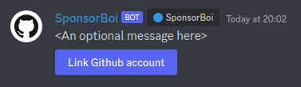
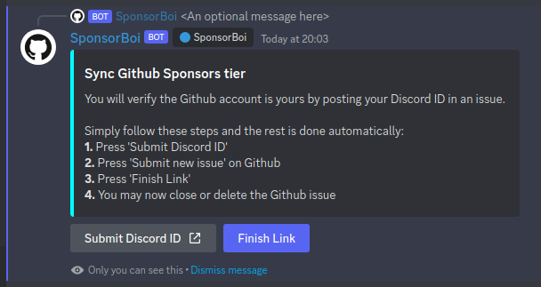
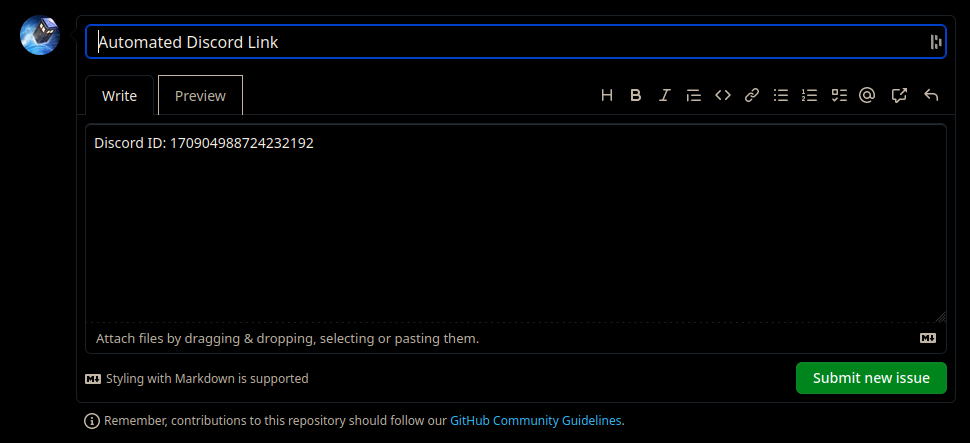
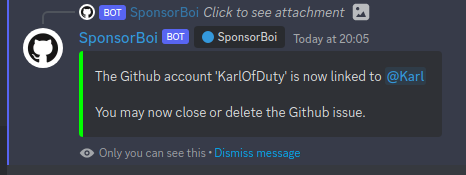

# SponsorBoi  <!---->  
A Discord bot which syncs Github Sponsors to Discord roles.

Discord users may register their Github accounts using bot commands and they can be granted roles depending on their sponsorship tiers via the Github API.

The bot works by having the user create an issue in one of your repositories containing their Discord ID, then run the link command in your Discord server. The bot then checks the most recent issues of the repo for the ID and links the Github user with the Discord user when it is found.

The user is then granted a role according to your config and the bot will re-check all linked users every two hours (by default) to make sure they are still a sponsor. If a user unlinks themselves they also lose their sponsor role until they re-link. If a linked user re-joins the Discord server they will retain their role.

## Commands

| Command                                   | Description                                                                                                              | Recommended Permission |
|-------------------------------------------|--------------------------------------------------------------------------------------------------------------------------|------------------------|
| `/link`                                   | Links your Discord account to your Github account.                                                                       | Everyone               |
| `/adminlink <discord user> <github user>` | Manually links a Discord account to a Github account.                                                                    | Admin/Moderator        |
| `/unlink`                                 | Unlinks your Github account.                                                                                             | Everyone               |
| `/adminunlink <discord user>`             | Manually unlinks a user's Github account.                                                                                | Admin/Moderator        |
| `/recheck (user)`                         | Forces a recheck of one or all linked users' sponsor status.                                                             | Admin/Moderator        |
| `/createlinkbutton (message)`             | Creates a button which starts the linking process when clicked. A message can be provided to be places above the button. | Admin                  |

## Usage example

1. An admin uses the `/createlinkbutton` command to place a link button:

2. A user clicks the button above (or uses the `/link` command) and are shown this message:

3. The user clicks the first button and is sent to a Github issue with the details filled in automatically:

4. The user submits the issue and clicks the finish link button in discord:

## Setup

1. Set up a mysql server, create a user and empty database for the bot to use.

2. Set up a Github repository where the bot will read issues for the automated linking.

3. [Create a new bot application](https://discordpy.readthedocs.io/en/latest/discord.html).

4. Download the bot for your operating system, either a [release version](https://github.com/KarlOfDuty/SponsorBoi/releases) or a [dev build](https://jenkins.karlofduty.com/blue/organizations/jenkins/SponsorBoi/activity).

5. Run `./SponsorBoi` on Linux or `./SponsorBoi.exe` on Windows, the config is created for you.

6. Set up the config (`config.yml`) to your specifications, there are instructions inside. If you need more help either contact me in Discord or through an issue here.

## Config:

Here is the default config with instructions on how to use it: [config.yml](./default_config.yml)
